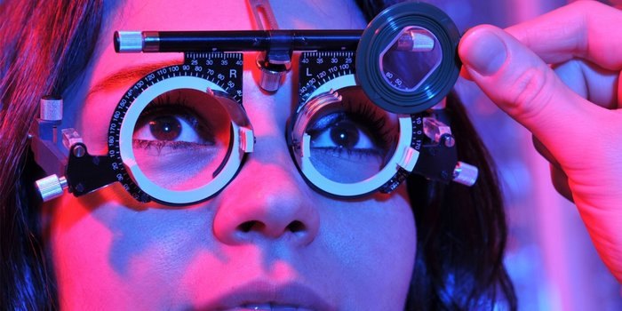
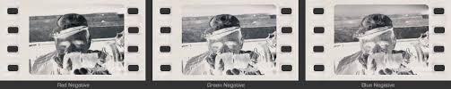
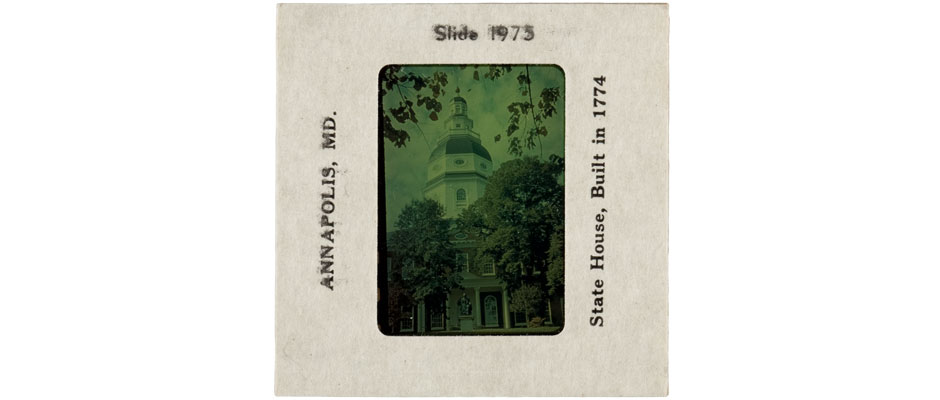

<h3>Proposal for project</h3>

 

For my proposal, I want to do a video piece about screens and how they changed over time. It went from black and white to color and that shift affected generations. There was a study conducted that people over the age of 55 were more likely to dream in monochrome because they grew up being exposed to black and white television. People who were younger than 55 were more likely to dream in color. I want to connect that idea together that screens are intertwined with us in a sense.

 

I want to incorporate film photography or a reference to film in some way to convey some nostalgia about the past. One of my ideas is to take pictures of people's eyes and making a stop motion with film scans. The scans will be compiled into a video where the colors shift from black to white to color over time. I also want to try making motion graphics about cells to incorporate with the video. Hopefully it all works out and I can convey the idea that human are biologically intertwined with screen exposure. 

